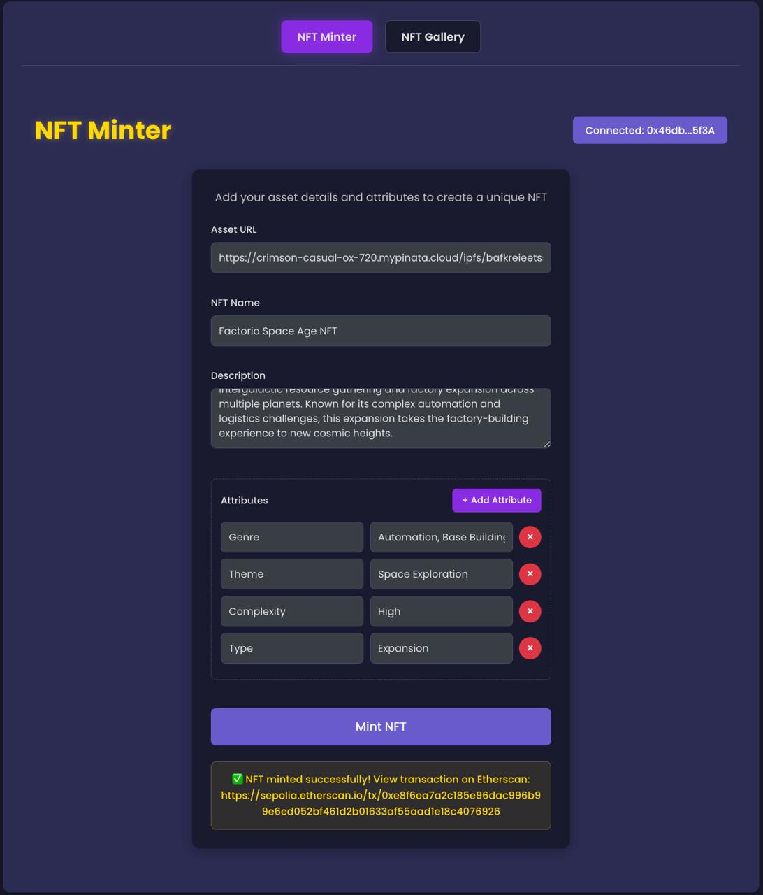

# [NFT Minter & Viewer](https://nft-minter-viewer-blockchainclubvit-six.vercel.app/)

## Hey there! Welcome to the NFT Minter & Viewer!  
## Hosted on Vercel(Link - https://nft-minter-viewer-blockchainclubvit-six.vercel.app/)

So, what's this all about? Well, it's a cool little app (we call them dApps in the crypto world!) that lets you do two main things:
- **Create your very own NFTs!** Yep, you can mint them right here.  
- **See all the NFTs you own!** No more guessing, your collection is right in front of you.  
We're building this on the **Ethereum blockchain** (specifically, the Sepolia testnet, so no real money involved for now!), and we're using some awesome tools like:  

- **Alchemy** for all the blockchain magic  
- **Pinata** to keep your NFT stuff safe and sound on IPFS  

## What Can This [App](https://nft-minter-viewer-blockchainclubvit-six.vercel.app/)
) Do?

- **Wallet Hook-up**: Connect your MetaMask wallet super easily.  
- **Minting NFTs**: Got an image or a cool idea? Give it a name, a description, and even add some unique traits. Boom, instant NFT!  
- **IPFS Power**: All the info about your NFT gets stored securely on IPFS, thanks to Pinata. Pretty neat, huh?  
- **Your NFT Gallery**: See all your digital treasures! The app fetches your NFTs straight from the blockchain, so it's always up-to-date.  
- **Looks Good Anywhere**: Whether you're on your phone or a big screen, it's designed to look great.  

## Tools We're Using

- **React.js**: That's the main tech for the app's look and feel.  
- **Ethers.js**: Our go-to for talking to the blockchain.  
- **Alchemy**: Helps us grab all your NFT info and chat with the Sepolia testnet.  
- **Pinata**: Our friendly neighborhood IPFS service.  
- **MetaMask**: Your digital wallet, essential for all the blockchain fun.  
- **Create React App & Friends** (react-app-rewired, customize-cra): These help us build everything smoothly, even with some tricky bits like Webpack 5.  
- **Plain Old CSS**: Keeping things looking sharp!  

## Let's Get Started!

Wanna run this on your own computer? Here's how to set it up.

## 📋 Stuff You'll Need First

Make sure you've got these installed:

- **Node.js & npm**: [Grab them from here](https://nodejs.org/). It's like the engine for our app.  
- **Git**: [Get it here](https://git-scm.com/). You'll need this to grab the project files.  
- **MetaMask Extension**: [Install it for your browser from here](https://metamask.io/). This is your digital wallet for Ethereum. Once it's in, set it up for the Sepolia Test Network. You'll need some test ETH for gas fees – you can usually get some free from a [Sepolia Faucet](https://sepoliafaucet.com/). There are other ways too, like Google Cloud Web3 portal or PoW faucets if you're feeling adventurous!

## 📂 Getting the Project Files

**Clone the project:**  
Open your terminal (that's the black screen where you type commands) and type this:

```bash
git clone https://github.com/soumyaGhoshh/nft-minter-viewer-blockchainclubvitb.git
cd nft-minter-viewer-blockchainclubvitb/soumya's-project/nft-minter/
```

**Install everything:**  
Now, inside that project folder, run this command to get all the necessary bits and bobs:
```bash
npm install
```
## 🔑 Setting Up Your Secret Keys (Environment Variables)

You'll need a special file called `.env` in the main project folder (`nft-minter`). This file holds your secret API keys and contract address, and don't worry, Git won't let it get accidentally uploaded to GitHub.

### Creating the .env File
 Create a new file named `.env` in the `nft-minter` directory
 Copy and paste the following content into it:
```env
REACT_APP_PINATA_KEY="YOUR_PINATA_API_KEY"
REACT_APP_PINATA_SECRET="YOUR_PINATA_SECRET_API_KEY"
REACT_APP_ALCHEMY_API_KEY="YOUR_ALCHEMY_API_KEY"
REACT_APP_ALCHEMY_NETWORK="eth-sepolia"
REACT_APP_CONTRACT_ADDRESS="YOUR_SMART_CONTRACT_ADDRESS"
```

- Pinata Keys: Grab these from your Pinata account dashboard.

- Alchemy API Key: Head over to your Alchemy dashboard and create a new app for Sepolia.

- Alchemy Network: Keep this as eth-sepolia for the Sepolia testnet.

- Contract Address: This is the unique ID for your NFT smart contract on Sepolia.

- Running the App on Your Computer
Once all that's done, you're ready to roll!
```bash
npm start
```

Your app should pop open in your browser at http://localhost:3000. It'll even refresh itself as you make changes – pretty neat!

## 📱 How to Use the App

### 🖌️ NFT Minter Tab

1. **Connect Your Wallet**  
   - Click the "Connect Wallet" button to link your MetaMask  
   

2. **Fill in NFT Details**  
   - **Asset URL**: IPFS link to your image/video (Pinata links work great!)  
   - **NFT Name**: Give your masterpiece a cool name  
   - **Description**: Explain what makes your NFT special  
   - **Attributes**:  
     - Click "+ Add Attribute"  
     - Add traits like:  
       - "Genre: Automation"  
       - "Complexity: High"  
     

3. **Mint Your NFT**  
   - Click "Mint NFT"  
   - Confirm transaction in MetaMask popup  

4. **Check Status**  
   - App will display minting status  
   - Provides Etherscan link to view on blockchain  

## 🖼️ NFT Gallery Tab

### 🔌 Wallet Check
- Ensure your MetaMask wallet is connected  
- The gallery automatically scans for your NFTs  


### 🏆 View Your Collection
- NFTs display in a clean grid layout  
- Each NFT card shows:  
  - Image preview  
  - NFT name  
  - Collection info  
  - Unique token ID  


### 🔄 Refresh Your Gallery
- Click "Refresh NFTs" to:  
  - Update after new mints  
  - Sync transferred NFTs  
  - Load latest metadata

## 📜 Smart Contract Info

**Contract Address**:  
`0x5cb7Ed8aB506576a5d3890CC4184bdB437128D7f` *(Sepolia Testnet)*  

**Contract ABI**:  
Located in `src/contract-abi.json` - this is your instruction manual for interacting with the smart contract.

## 🙏 Big Thanks To...

- **Blockchain Club VITB**: For this amazing opportunity
- **Create React App**: For the quick project setup!  
- **Alchemy**: For reliable blockchain data  
- **Pinata**: Our IPFS storage hero  
- **MetaMask**: Essential wallet integration  
- **Ethers.js**: Simplified blockchain interactions  
- **react-app-rewired & customize-cra**: Webpack configuration wizards  